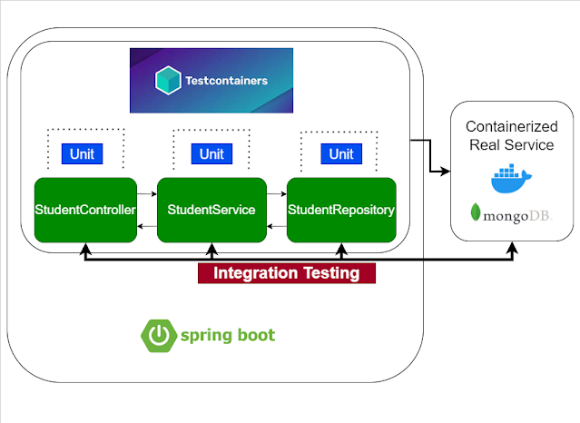

# Spring Boot MongoDB - Integration Testing with Testcontainers

    

## Testcontainers

Testcontainers es una biblioteca de código abierto para pruebas que permite ejecutar contenedores Docker directamente en nuestras aplicaciones Spring Boot, facilitando la realización de pruebas de integración con dependencias reales.

Esta herramienta proporciona instancias de contenedores para diversas tecnologías comunes, como bases de datos (en este caso, MongoDB), brokers de mensajes, navegadores web para pruebas con Selenium, o cualquier otro servicio que pueda ejecutarse dentro de un contenedor Docker.

Con Testcontainers, podemos asegurarnos de que nuestras pruebas de integración se realicen en un entorno lo más parecido posible a un entorno de producción, eliminando dependencias de servicios externos y simplificando la configuración de pruebas que requieren componentes externos.